# Docker
### Frontend
we create a multi stage docker file for front end with a nginx server running on port 80 with exposure of that port

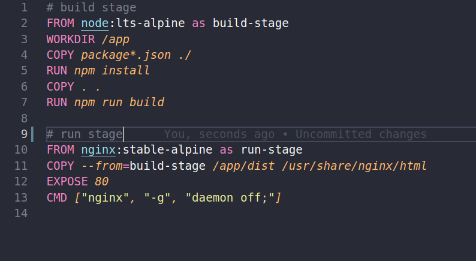

###  backend

we added 4 fictional persons using the person controller

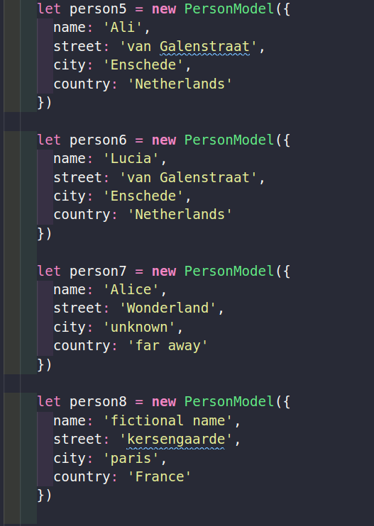

we seed the data base from a json object as well :

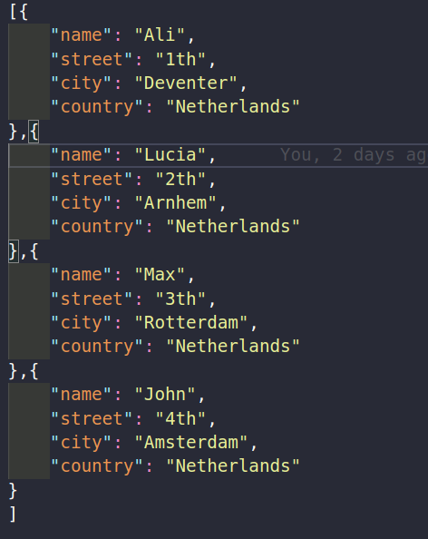

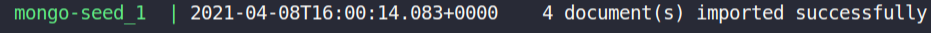

Main docker compose looks like this:

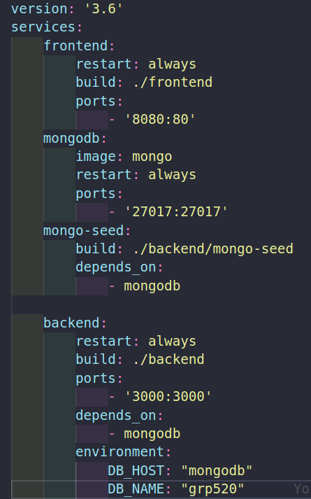

It has 4 services which the mongo db image will be pulled from docker hub and the rest of them has the docker file in the path referred in the `build` option of the services

here the mentioned docker files:

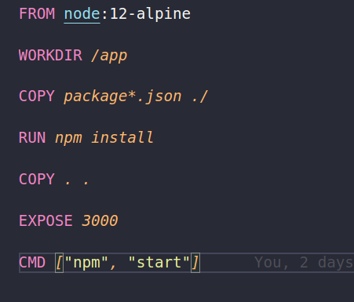

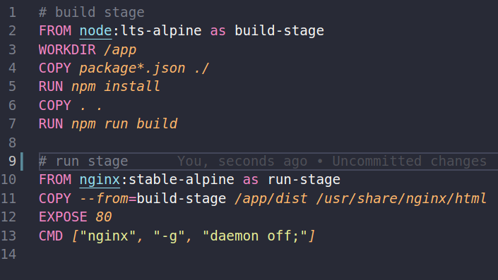

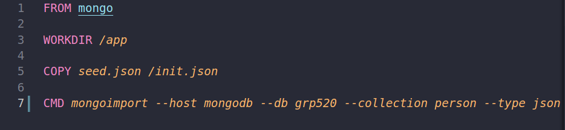

and here is the web site running on with the docker compose 

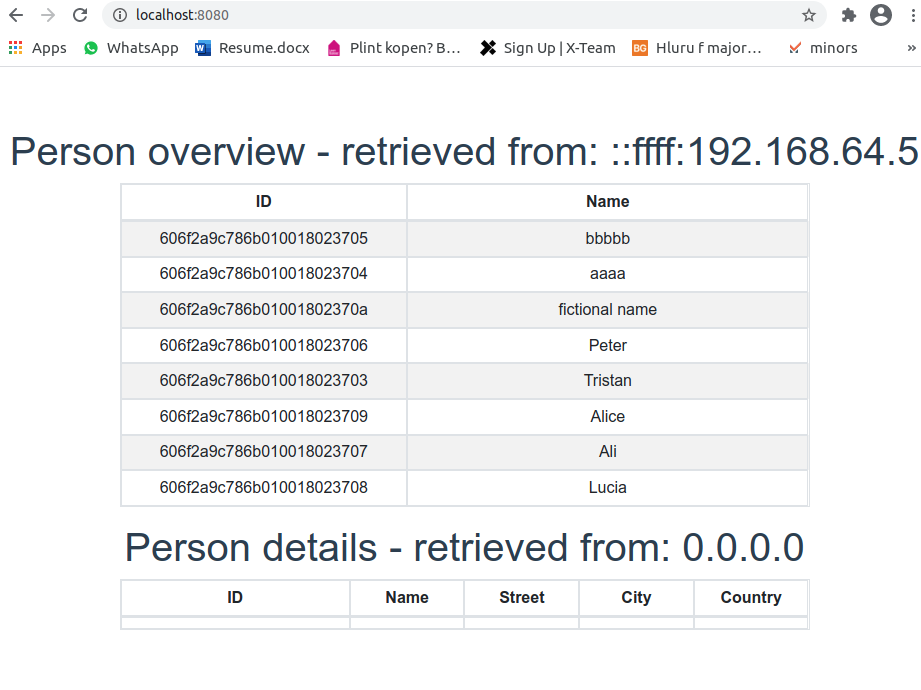

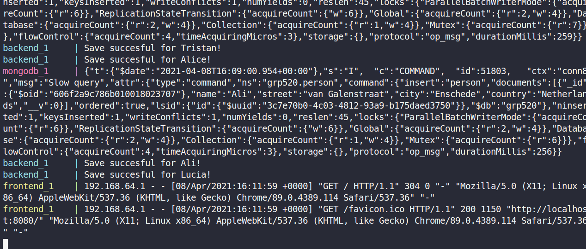

### gitlab CD

As stated in the assignment we generated a ssh key and placed the private key on gitlab variable and used ``ssh-copy-id devtools-520@vps2644.directvps.nl`` to copy the public key to the vps .

the gitlab yml file has been created from the snippet and we add scp command with right arguments such as identifier and dist folder source to public_html on the vps

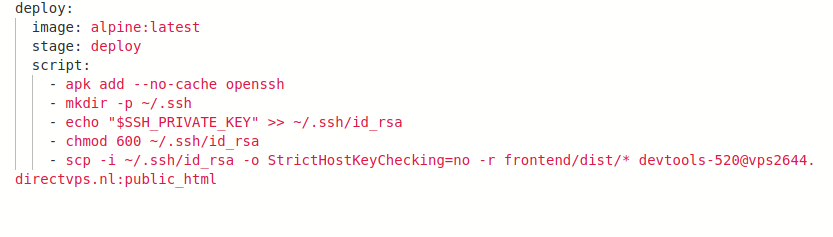

we changed the background image and pushed the code so the gitlab runner can perform the job

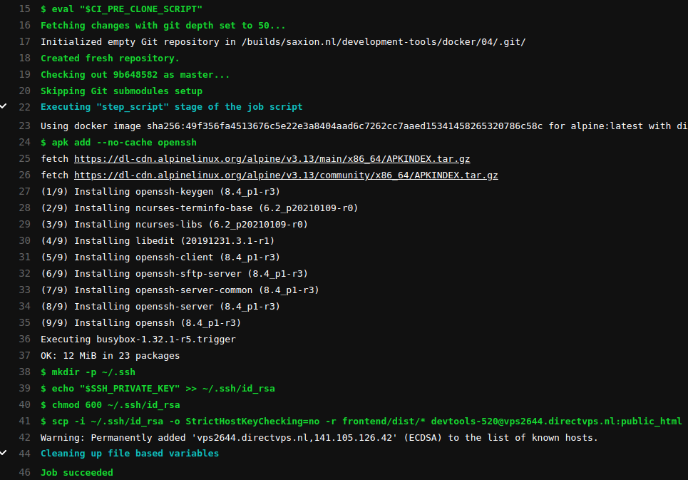

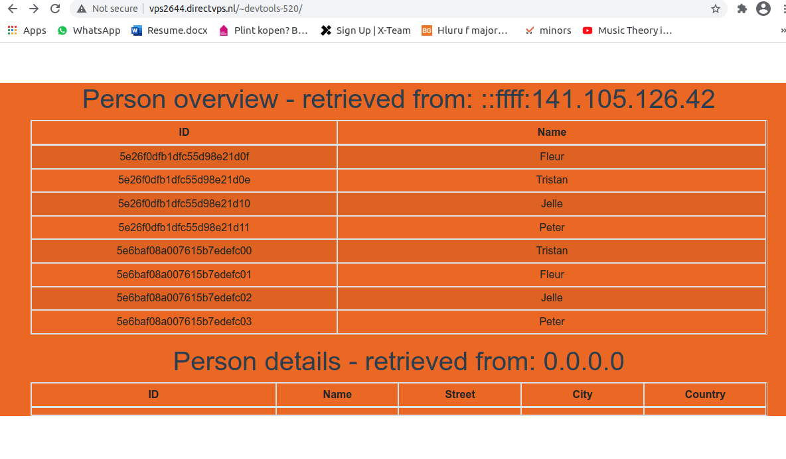
