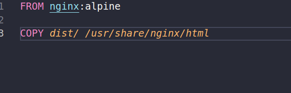
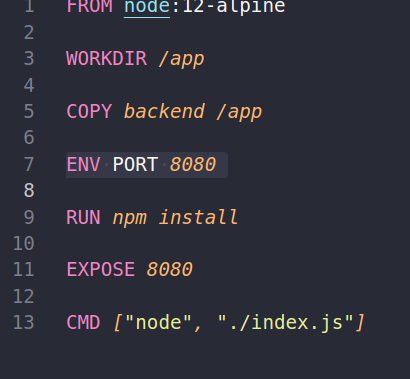
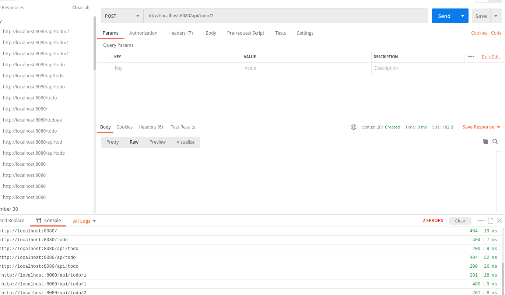
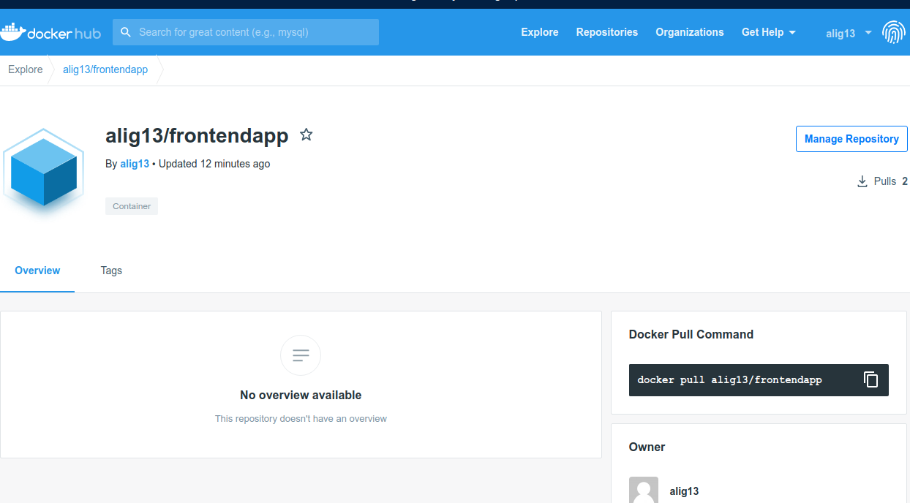
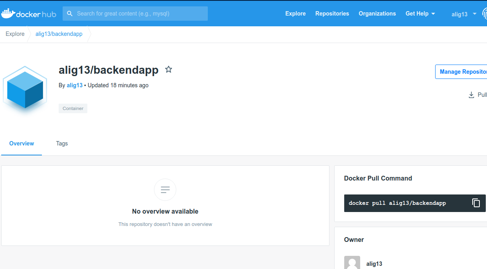
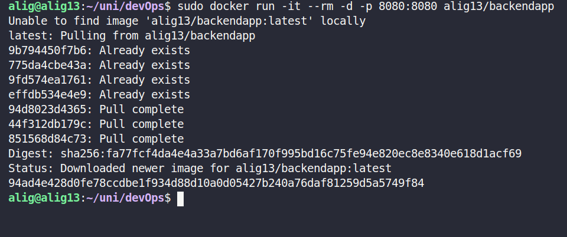

# Docker

### with nginX

binding the dist folder of the last week with nginx folder inside the container along with port binding

` sudo docker container run -d -p 8080:80 -v  /home/alig/uni/devOps/44/frontend-webpack/dist:/usr/share/nginx/html --name nginx-website nginx `

### docker file

we created a simple docker file which run the nginx and our frontend dist folder with the name of mywebserver

then we run it with port binding 

` sudo docker run -d -p 8080:80 mywebserver`

### backend

we created the docker file with following configuration

`sudo docker build -t mybackendapp .`

after building it we run it by binding it to the exposed port and test it with postman

### publish 

we logged in with user password and changed the tag name to match and then push it ` docker push alig13/backendapp `

